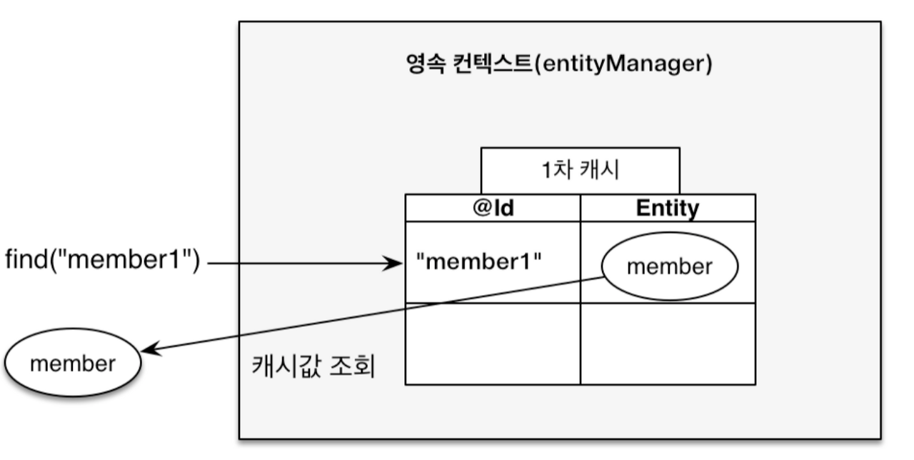

# JPA 핵심 정의 정리
---

[자바 ORM 표준 JPA 프로그래밍](https://catalog.11st.co.kr/catalogs/17512535?trTypeCd=PW51&trCtgrNo=585021) 책과 여러 블로그를 참조해 작성하였습니다.

---
## `flush` 메서드

Query를 DB에 보내 영속성 컨텍스트와 DB의 싱크를 맞추는 메서드이다.

`flush` 메서드가 호출된 후, 프로세스

- **변경감지 (Dirty Checking) 수행**
    - 수정된 엔티티에 대한 Update query를 생성해 쓰기 지연 SQL 저장소에 저장
- **쓰기 지연 SQL 저장소의 Query들을 데이터베이스에 전송**

`flush` 라는 의미 때문에 1차 캐시를 비우고 싱크를 맞추는 동작을 할 것 같은데, 1차 캐시를 지우진 않는다.

- 즉, 영속성 컨텍스를 비우지 않으므로 그 단어의 의미로 오해하지 말자.

`flush` 가 호출되는 경우는 3가지로 볼 수 있다.

1. `em.flush` 를 통해 명시적으로 호출 → 보통은 이렇게 사용하지 않음.
2. Transaction `commit` 시, 자동으로 `flush` 호출
    - 왜냐하면 Transaction의 `commit` 이 호출될 때, 자동으로 `flush` 를 호출해주기 때문에 Transaction이 끝남에 따라 자동으로 DB와 싱크를 맞추게 된다.
3. JPQL Query 실행 시, 자동으로 `flush` 호출

이렇게 `flush` 가 동작할 수 있는 이유(원리)는 데이터베이스의 Transaction 작업 단위가 존재하기 때문이다.

- Transaction의 시작/커밋 시점에만 동기화 작업을 수행하면 되기 때문에 이에 맞춰 `flush` 작업을 수행할 수 있도록 지원하고 있다.

<br>

## 1차/2차 캐시

서버에서 데이터베이스 연산 처리시, 보통 네트워크를 통해 데이터베이스에 접근해 요청을 처리한다. 이 과정은 당연히도 서버 단의 메모리에서 작업을 수행하는 것보다 훨씬 오래 걸린다.

즉, 이러한 시간을 단축시키기 위해 조회했던 데이터를 서버 메모리에 캐싱해두는 방법이 있다.

### 1차 캐시



영속성 컨텍스트 내부에는 **엔티티의 식별자를 Key로 엔티티를 보관하는 저장소가 존재하는데, 이를 `1차 캐시`** 라고 한다.

- 일반적으로 트랜잭션을 시작하고, 종료할 때까지만 `1차 캐시`가 유효하다. 그렇기에 애플리케이션의 전체 관점에서 보면 데이터베이스 접근 횟수를 획기적으로 줄일 수 없는 경우가 있다.
- JPA 특징 - 동일성 특징을 만족하기 때문에 데이터를 계속해서 가져오더라도 같은 식별자를 가지는 엔티티의 경우, 동일성이 보장된다.
- 1차 캐싱은 별다른 설정 없이 기본적으로 사용하게 된다.


일반적으로 `find` 같은 요청이오면, 1차적으로 `1차 캐시` 를 확인한다. `1차 캐시` 에 데이터가 있으면 가져와 바로 사용하고, 없으면 직접 데이터베이스까지 가서 찾아온다.

앞서 이야기했듯, `1차 캐시` 는 트랜잭션 단위로 유효하기에 사실 더 큰 범위에서 캐싱은 지원하지 못한다. 

### 2차 캐시

`2차 캐시`는 애플리케이션 단위로 캐싱하는 것을 의미한다. 애플리케이션의 시작부터 종료까지 캐싱이 유지된다. 그렇기에 앞선 `1차 캐시`보다 더 넓은 범위의 캐싱을 지원한다.

**`2차 캐시`에서는 동일성을 보장하지 못한다.**

- `1차 캐시`에서는 트랜잭션 범위로 캐싱이 되어 서로 다른 트랜잭션 간에 공유가 되지 않았다. 그렇기에 동시성 이슈가 없었다. 하지만 `2차 캐시`는 애플리케이션 단위에서 여러 트랜잭션들이 함께 공유하며 사용하게 된다.
- 그렇기에 동시에 객체를 수정하는 등의 문제가 있을 수 있고, 이마다 객체에 락을 걸어주는 추가적인 행동이 필요하게 된다. 이렇게 되면 동시성이 떨어지고, 성능저하의 문제로 이어질 수 있으므로 **객체를 직접 반환하지 않고, 복사본을 만들어 반환한다.**

<br>

## 쓰기 지연

`쓰기 지연` 이란 `persist` 메서드 실행 시 바로 INSERT 쿼리를 보내는 것이 아니라 버퍼(쓰기 지연 SQL 저장소)에 INSERT 쿼리를 저장해두었다가 `flush` 메서드 수행 시에 한 번에 DB로 보내는 것을 말 한다.

- INSERT 뿐 아니라 UPDATE 쿼리, DELETE 쿼리도 저장해 사용하곤 한다.

프로세스를 보면

- `persist` 메서드 호출
- 1차 캐시에 데이터 저장
- INSERT SQL 생성해 쓰기지연 SQL 저장소에 저장

    

- `flush` 호출
- 쓰기 지연 SQL 저장소에 모아둔 SQL을 DB로 전송

    

`쓰기 지연` 은 왜 사용하는걸까? 그냥 바로바로 INSERT Query를 보내면 안되나?

- **잦은 DB 통신으로 오는 오버헤드를 줄일 수 있다.** Query를 보낸다는 것은 DB와 네트워크 통신을 통해 데이터를 주고 받는다는 것을 의미한다. 즉, Query 1번 당 네트워크 통신을 한 번씩은 한다는 것인데, 네트워크 통신은 상당한 비용이 드는 작업이다. 보통 이러한 문제가 있어 Query를 한번에 모아 전송하는 Batch 작업을 사용하곤 한다. JPA에서는 Flush 기능이 있어 Batch 작업 같이 사용할 수 있게 되는 것이다. 고로, 효율적으로 수행할 수 있게 된다.
- 또한, **데이터베이스 Table Row의 락이 걸리는 시간을 최소화 할 수 있다.** `flush` 메서드를 수행하기 이전까지는 데이터베이스에 데이터를 생성/수정/삭제를 하지 않기 때문에 락을 걸지 않는다. 그렇기에 락을 걸리는 시간을 최소화 시킬 수 있고, 데이터베이스에서 동시에 더 많은 트랜잭션을 처리할 수 있도록 한다.

`쓰기 지연` 이 동작하지 않는 경우는 꽤 많다. 그러므로 잘 생각해야 한다.

- 자세한 예는 아래 블로그를 참조해보자.

    [JPA 영속성 컨텍스트의 1차캐시 & 쓰기지연은 정말 동작하는가?](https://jobc.tistory.com/209?openLinerExtension=true)

- 한 가지 예로 기본 키(PK) 설정 중 `GeneratedValue` 에서 `GenerationType.IDENTITY` 전략을 사용하면 `쓰기 지연` 대로 동작하지 않고, `persist` 즉시 query를 전송한다.
    - 왜 일까? 생각하면 단순하다. `GenerationType.IDENTITY` 기본키 전략은 기본키 생성 값(전략)을 데이터베이스에 일임하겠다는 것이다. 즉, 기본키 값 생성을 데이터베이스에서 하게 된다.
    - 만약 `persist` 를 한 후 `쓰기 지연` 을 동작한다고 해보자.

        ```java
        // Member -> memberId / name / age
        Member m = new Member("Kim xx", 27);
        em.persist(m);
        System.out.println(m.getMemberId()); // ??
        ```

        - `쓰기 지연` 을 하게 되면 `memberId` 를 제대로 출력할 수 없을 것이다. 기본키 생성을 데이터베이스에 일임했는데, 데이터베이스에 아직 갔다오지 않았으니 말이다.
    - 이렇듯, 너무 단순히만 생각하면 제대로 `쓰기 지연` 이 제대로 동작하지 않을 수 있다.

<br>

## 변경 감지 (Dirty Checking)

~~JPA에서 엔티티에 대한 변경 작업을 한 뒤, `update` 메서드를 활용해 엔티티 변경을 수행한다.~~ 같은 건 없다. 

JPA에서는 엔티티 변경 후, flush를 수행하면 자동으로 변경된 부분을 감지해 DB에 변경사항을 업데이트하게 된다.

- `persist` 메서드 또한 사용하지 않아도 된다.
- 단지 중요한 건, 업데이트할 엔티티는 영속성 컨텍스트에서 관리되는 대상(`Managed` 상태)이여만 한다.


**엔티티를 1차 캐시에 저장할 때, 동시에 스냅샷 필드도 저장하게 된다.**

- 스냅샷은 **저장된 데이터의 기본 상태(최초 상태)** 라고 보면 된다.
- `flush` 작업을 수행할 때, **엔티티와 엔티티의 스냅샷을 비교하게 된다.** 이를 통해 엔티티의 데이터 변경사항이 존재하는지 확인하게 되고, 변경사항이 있으면 UPDATE SQL Query을 만들어 쓰기지연 SQL 저장소에 추가한다.

변경감지는 영어로 하면 **Dirty Checking**이라고 한다.

- Dirty Checking이라는 말은 `엔티티와 엔티티의 스냅샷을 비교해 변경된 데이터를 찾는다` 에서 왔다고 생각하면 이해하기 쉽다.

변경감지에서 UPDATE Query는 기본적으로 전체 필드를 다 업데이트하는 식으로 만들어진다.

- `@DaynamicUpdate` 를 사용해 변경된 필드만 Update Query에 반영되도록 할 수도 있다.

`update` 같은 수정사항을 반영하는 메서드가 없다는 것이 어색하게 다가 올 수도 있다. 하지만 객체 관점, 프로그래밍 관점에서 보면 이것은 당연하다.

- Java `List` 를 생각해보자. `List` 의 데이터 중 하나를 수정한다고 가정하면, 단순히 `List` 인덱스에 접근해 데이터를 수정하면 된다. `list.set(0, 4);` 같이 말이다.
- `List` 에서 수정 작업을 한 후에 `update` 같은 메서드를 호출하는가? 아니다. 값을 수정했다는 것이 바로 데이터를 수정한 것으로 따로 해주지 않아도 된다.
- JPA에서의 엔티티 수정도 같은 맥락에서 이해하면 이해하기 쉽다.
