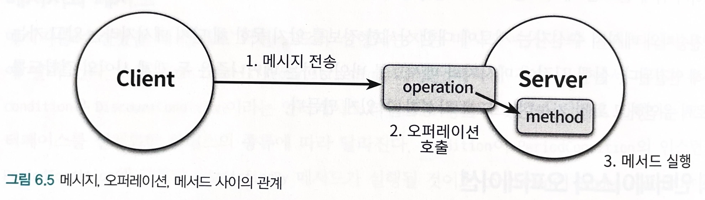

# 6장 — 메시지와 인터페이스

[6장 예제 코드 (GitHub)](https://github.com/gyumin-kim/objects-sample/tree/master/src/main/java/samples/ch06)

- 애플리케이션은 클래스로 구성되지만, 메시지를 통해 정의된다.
    - 객체지향 애플리케이션의 가장 중요한 재료는 ~~클래스~~가 아니라 객체들이 주고받는 메시지다.
    - 객체가 수신하는 메시지들이 객체의 퍼블릭 인터페이스를 구성한다.
- 훌륭한 퍼블릭 인터페이스를 얻기 위해, 유연하고 재사용 가능한 퍼블릭 인터페이스를 만드는 데 도움이 되는 설계 원칙과 기법들을 적용해야 한다.

# 01 협력과 메시지

- 협력은 클라이언트가 서버의 서비스를 요청하는 단방향 상호작용이다(클라이언트-서버 모델).
- 객체는 협력에 참여하는 동안 클라이언트와 서버의 역할을 동시에 수행하는 것이 일반적이다.
- 객체가 독립적으로 수행할 수 있는 것보다 더 큰 책임을 수행하기 위해서는, 다른 객체와 협력해야 한다.

## 메시지와 메시지 전송

- 메시지(message)
    - 객체들이 협력하기 위해 사용할 수 있는 유일한 의사소통 수단
    - 오퍼레이션명(operation name)과 인자(argument)로 구성됨
- 메시지 전송(message sending) 또는 메시지 패싱(message passing)
    - 한 객체가 다른 객체에게 도움을 요청하는 것
    - 메시지에 메시지 수신자를 추가한 것
        - 즉 메시지 전송은 메시지 수신자, 오퍼레이션명, 인자의 조합

## 메시지와 메서드

- 메시지를 수신했을 때 실제로 어떤 코드가 실행되는지는 메시지 수신자의 실제 타입이 무엇인가에 달려 있다.
- 메서드
    - 메시지를 수신했을 때 실제로 실행되는 함수 또는 프로시저
    - 코드 상에서 동일한 이름의 변수에게 동일한 메시지를 전송하더라도, 객체의 타입에 따라 실행되는 메서드가 달라질 수 있다.
- 메시지와 메서드의 구분은 메시지 전송자와 수신자가 느슨하게 결합될 수 있게 한다.
    - 메시지 전송자는 자신이 어떤 메시지를 전송해야 하는지만 알면 된다.
    - 메시지 수신자도 누가 메시지를 전송하는지 알 필요가 없다. 메시지를 처리하기 위해 필요한 메서드를 스스로 결정할 수 있는 자율권을 누린다.

## 퍼블릭 인터페이스와 오퍼레이션

- 퍼블릭 인터페이스
    - 객체가 의사소통을 위해 외부에 공개하는 메시지의 집합
- 오퍼레이션
    - 퍼블릭 인터페이스에 포함된 메시지
    - 수행 가능한 어떤 행동에 대한 추상화
    - 내부의 구현 코드는 제외하고 단순히 메시지와 관련된 시그니처를 가리키는 경우가 대부분
    - cf) 메시지를 수신했을 때 실제로 실행되는 코드는 '메서드'. 즉 메서드는 오퍼레이션에 대한 구현

객체가 다른 객체에게 **메시지를 전송**하면 런타임 시스템은 메시지 전송을 **오퍼레이션 호출로 해석**하고, 메시지를 수신한 객체의 **실제 타입을 기반으로 적절한 메서드를 찾아 실행**한다.

## 시그니처

- 오퍼레이션의 이름과 파라미터 목록을 합쳐 시그니처(signature)라고 부른다.
- 오퍼레이션은 실행 코드 없이 시그니처만을 정의한 것이며, 메서드는 시그니처에 구현을 더한 것이다.

※ 다형성이란, 동일한 오퍼레이션 호출에 대해 서로 다른 메서드들이 실행되는 것

# 02 인터페이스와 설계 품질

## 디미터 법칙(Law of Demeter)

- 협력하는 객체의 내부 구조에 강하게 결합되지 않도록 협력 경로를 제한하라
- "낯선 자에게 말하지 말라" 또는 "오직 인접한 이웃하고만 말하라"
- 객체들의 협력 경로를 제한하면 결합도를 효과적으로 낮출 수 있다.
- 모든 클래스 C와 C에 구현된 모든 메서드 M에 대해서, M이 메시지를 전송할 수 있는 모든 객체는 아래의 클래스의 인스턴스여야 한다.
    - M의 인자로 전달된 클래스(C 자체를 포함)
    - C의 인스턴스 변수의 클래스
- 디미터 법칙을 따르면 부끄럼타는 코드(shy code)를 작성할 수 있다.
    - 불필요한 어떤 것도 다른 객체에게 보여주지 않으며, 다른 객체의 구현에 의존하지 않는 코드
    - 디미터 법칙을 위반한다는 것은, 클라이언트에게 구현을 노출한다는 것을 의미
- 객체는 자기 자신을 책임지는 자율적인 존재여야 한다.
- 객체의 내부 구조를 묻는 메시지가 아니라, 수신자에게 무언가를 시키는 메시지가 더 좋은 메시지

## 묻지 말고 시켜라(Tell, Don't Ask)

> 절차적인 코드는 정보를 얻은 후에 결정한다.
객체지향 코드는 객체에게 그것을 하도록 시킨다.

- '디미터 법칙'을 장려하는 원칙
- 이 원칙을 따르면, 객체의 정보를 이용하는 행동을 객체의 외부가 아닌 내부에 위치시키기 때문에, 자연스럽게 정보 전문가에게 책임을 할당하게 되고 높은 응집도를 가진 클래스를 얻을 확률이 높아진다.
- 내부의 상태를 이용해 어떤 결정을 내리는 로직이 객체 외부에 존재하는가?
    - 그렇다면 해당 객체가 책임져야 하는 어떤 행동이 객체 외부로 누수된 것이다.
    (캡슐화 위반)
- 상태를 묻는 오퍼레이션을 → 행동을 요청하는 오퍼레이션으로 대체함으로써 인터페이스를 향상시켜라.
- 훌륭한 인터페이스를 얻기 위해서는 객체가 '어떻게' 작업을 수행하는지를 노출해서는 안 된다.
(어떻게 하는지가 아니라 무엇을 하는지를 서술)

## 의도를 드러내는 인터페이스(Intention Revealing Interface)

- 구현과 관련된 모든 정보를 캡슐화하고, 객체의 퍼블릭 인터페이스에는 협력과 관련된 의도만을 표현해야 한다.
- 메서드의 이름은 '어떻게'가 아니라 '무엇'을 하는지를 드러내도록 지어야 한다.
    - 메서드가 무엇을 하느냐에 초점을 맞추면, 클라이언트의 관점에서 동일한 작업을 수행하는 메서드들을 하나의 타입 계층으로 묶을 수 있는 가능성이 커진다.
    (공통된 하나의 역할로 대체; 인터페이스 활용)
- 하나의 구현을 가진 메시지의 이름을 일반화하도록 도와주는 간단한 훈련법(Kent Beck)
    - 매우 다른 두 번째 구현을 상상하라. 그리고 해당 메서드에 동일한 이름을 붙인다고 상상해본다.
    - 그러면 가능한 가장 추상적인 이름을 떠올리게 될 것이다.

---

- 디미터 법칙 → 객체 간의 협력을 설계할 때 캡슐화를 위반하는 메시지가 인터페이스에 포함되지 않도록
- 묻지 말고 시켜라 법칙 → 디미터 법칙을 준수하는 협력을 만들기 위한 스타일 제시
- 의도를 드러내는 인터페이스 원칙 → 객체의 퍼블릭 인터페이스에 어떤 이름이 드러나야 하는지에 대한 지침 제공

# 03 원칙의 함정

## 디미터 법칙은 하나의 도트(.)를 강제하는 규칙이 아니다

- 디미터 법칙은 결합도와 관련된 것, 즉 문제가 되는 것은 객체의 내부 구조가 외부로 노출되는 경우에 한함.
- 하나 이상의 도트(.)를 사용하는 모든 케이스가 디미터 법칙 위반은 아니다.
    - ex) `IntStream.of(1, 15, 20, 3, 9).filter(x -> x > 10).distinct().count();`
    - 객체를 다른 객체로 변환만 할 뿐, `IntStream`의 내부 구조가 외부로 노출되는 것은 아님

## 결합도와 응집도의 충돌

- 캡슐화를 위해 '묻지 말고 시켜라' 스타일을 준수하다보면, 오히려 객체의 응집도가 낮아지고 결합도가 높아지는 경우가 생긴다.
- 때로는 A의 캡슐화가 조금 깨지더라도, A의 응집도를 높이고 A와 B 사이의 결합도를 낮추도록 하는 것이 전체적인 관점에서 더 좋을 수도 있다.
- '묻지 말고 시켜라' 스타일을 무조건적으로 적용하기보다는, 각 객체가 담당해야 하는 본질적인 책임이 무엇인지를 고민할 필요

> "디미터 법칙의 위반 여부는 묻는 대상이 객체인지 자료 구조인지에 달려있다." (Robert C. Martin)

- 객체는 내부 구조를 숨겨야 하므로 디미터 법칙을 따르는 것이 좋고, 자료 구조는 당연히 내부를 노출해야 하는 것

# 04 명령-쿼리 분리 원칙

- 명령-쿼리 분리(Command-Query Separation) 원칙

> 오퍼레이션은 부수효과를 발생시키는 '명령'(=프로시저)이거나, 부수효과를 발생시키지 않는 '쿼리'(=함수) 중 하나여야 한다.

- 어떤 오퍼레이션도 명령인 동시에 쿼리여서는 안된다.
- 객체의 상태를 변경하는 명령은 반환값을 가질 수 없고, 객체의 정보를 반환하는 쿼리는 상태를 변경할 수 없다.
- 루틴(routine)
    - 어떤 절차를 묶어 호출 가능하도록 이름을 부여한 기능 모듈
    - 명령, 쿼리
- 명령(Command)
    - 객체의 상태를 수정하는 오퍼레이션
    - 프로시저(procedure)와 동일
    - 부수효과를 발생시킬 수 있지만 값을 반환할 수 없다.
- 쿼리(Query)
    - 객체와 관련된 정보를 반환하는 오퍼레이션
    - 함수(function)와 동일
    - 값을 반환할 수 있지만 부수효과를 발생시킬 수 없다.

## 반복 일정의 명령과 쿼리 분리하기

- [예제 코드 (GitHub)](https://github.com/gyumin-kim/objects-sample/tree/master/src/main/java/samples/ch06)
- 겉으로 보기에는 쿼리처럼 보이지만, 내부적으로 부수효과를 가지는 메서드?
    - 이해하기 어렵고, 잘못 사용하기 쉬우며, 버그를 양산하는 경향
    - 가장 깔끔한 해결책은 **명령과 쿼리를 명확하게 분리**하는 것
- 퍼블릭 인터페이스를 설계할 때, 부수효과를 가지는 대신 값을 반환하지 않는 명령과, 부수효과를 가지지 않는 대신 값을 반환하는 쿼리를 분리하자
    - 코드는 예측 가능하고 이해하기 쉬우며, 디버깅이 용이한 동시에 유지보수가 수월해진다.

## 명령-쿼리 분리와 참조 투명성

- 참조 투명성(referential transparency)
    - 어떤 표현식 e가 있을 때, 모든 e를 e의 값으로 교체하더라도 결과가 달라지지 않는 특성
- 불변성(immutability)
    - 어떤 값이 변하지 않는 성질
- 불변성은 부수효과의 발생을 방지하고 참조 투명성을 만족시킨다.
- 참조 투명성을 만족하는 식의 장점
    - 모든 함수를 이미 알고 있는 하나의 결과값으로 대체할 수 있으므로, 식을 쉽게 계산할 수 있다.
    - 모든 곳에서 함수의 결과값이 동일하므로, 식의 순서를 변경하더라도 각 식의 결과는 달라지지 않는다.
- 명령-쿼리 분리 원칙은 부수효과를 가지는 명령으로부터 부수효과를 가지지 않는 쿼리를 명백하게 분리함으로써, 제한적이나마 참조 투명성의 혜택을 누릴 수 있게 해준다.
- 함수형 프로그래밍(functional programming)
    - 부수효과가 존재하지 않는 수학적인 함수에 기반
    - 참조 투명성의 장점을 극대화, 명령형 프로그래밍에 비해 프로그램의 실행 결과를 이해하고 예측하기가 더 쉽다.

## 책임에 초점을 맞춰라

- 책임 주도 설계 방법에 따라 메시지가 객체를 결정하게 하라
- 참고) 계약에 의한 설계(Design By Contract)
    - 협력을 위해 클라이언트와 서버가 준수해야 하는 제약을 코드 상에 명시적으로 표현하고 강제할 수 있는 방법
    - 책 '부록 A' 참조